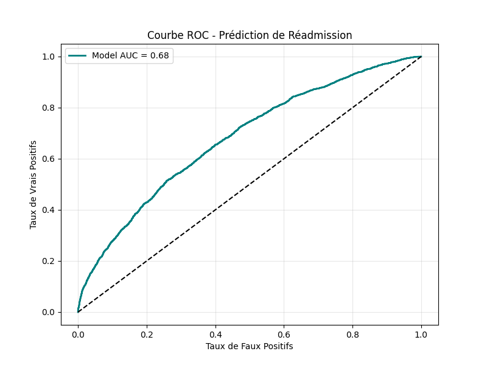

# Hospital Readmission Prediction (Diabetes Care)


## 📋 Overview
This project aims to predict **hospital readmissions within 30 days** for diabetic patients. Readmission is a critical metric in healthcare (impacting costs and patient quality of life).

Using the **UCI Diabetes 130-US Hospitals Dataset**, I developed a Machine Learning pipeline capable of identifying high-risk patients with an **AUC-ROC of 0.68**.

### 🔍 Key Results
| Metric | Score | Note |
| :--- | :--- | :--- |
| **AUC-ROC** | **0.68** | Effective for population screening. |
| **Precision** | Variable | Trade-off adjusted via threshold tuning. |
| **Model** | **HistGradientBoosting** | Optimized for tabular data & missing values. |

---

## 📊 The Data
* **Source:** [UCI Machine Learning Repository](https://archive.ics.uci.edu/ml/datasets/diabetes+130-us+hospitals+for+years+1999-2008)
* **Volume:** ~100,000 encounters, 10 years of data.
* **Features:** Patient demographics, admission details, ICD-9 diagnostic codes, medications, and lab tests (HbA1c, Glucose).

---

## ⚙️ Methodology

### 1. Data Cleaning & Preprocessing
* **Exclusions:** Removed records resulting in death or hospice transfer (as readmission is impossible).
* **Missing Values:** Handled `?` values as `NaN`; leveraged Gradient Boosting's native ability to handle missing data without aggressive imputation.
* **Target Engineering:** Binary classification (`<30 days` vs `NO/>30 days`).

### 2. Feature Engineering
* **Age Mapping:** Converted age intervals (e.g., `[70-80)`) to numeric centroids.
* **Medical Complexity:** Aggregated number of procedures, medications, and historical visits (inpatient/outpatient).
* **High-Cardinality Encoding:**
    * Low cardinality categorical variables (<255 unique values) are handled natively by the model.
    * High cardinality variables (like specific medical specialties) are label-encoded.

### 3. Modeling Strategy
I selected **`HistGradientBoostingClassifier`** (Scikit-Learn's implementation inspired by LightGBM) for three reasons:
1.  **Speed:** Much faster than traditional Random Forest on large datasets.
2.  **Native NaN Support:** No need for biased mean/median imputation.
3.  **Native Categorical Support:** More efficient than One-Hot Encoding for this dataset.

---

## 📈 Analysis & Insights

### Performance (ROC Curve)
The model achieves an **AUC of ~0.68**. While significantly better than random guessing (0.5), it highlights the complexity of human health prediction using only structured administrative data.


*(Note: Generate this image by running the script)*

### Key Drivers of Readmission
Through feature importance analysis, the model identified:
1.  **Prior Inpatient Visits:** The strongest predictor. A history of hospitalization breeds future hospitalization.
2.  **Discharge Disposition:** Patients discharged to "Skilled Nursing Facilities" or "Home Health Care" are at higher risk.
3.  **Number of Diagnoses:** Proxy for the patient's overall fragility.

---

## 🚀 How to Run

### Prerequisites
```bash
pip install -r requirements.txt

The script will:

Clean and preprocess data.

Train the model.

Output performance metrics.

Save plots (roc_curve_final.png) and the model (readmission_model.pkl).

🔮 Future Improvements
To bridge the gap from 0.68 to 0.80+, future iterations would require:

NLP on Clinical Notes: Extracting sentiment and keywords from unstructured nursing notes (often containing the "real" story).

Social Determinants: Incorporating data on patient socioeconomic status (zip code income, family support), which are massive drivers of readmission.

Time-Series Analysis: Using LSTM/Transformers on the sequence of vitals during the stay.
